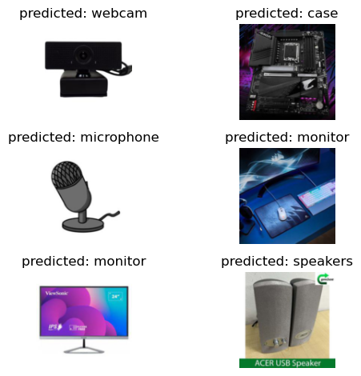

# Датасет компютерных частей
Этот датасет предназначен для обучения распознования компьютерной переферии, а также деталей для ПК. Включает в себя изображения различных устройств, например, видеокарта, микрофон и другие. Изображения находятся в структуре ImageNet, причем у каждого класса есть своя собственная папка, содержащая соответствующие изображения. Изображения имеют разрешение 256x256 пикселей.

## Использование 
Датасет можно загрузить с [Kaggle](https://www.kaggle.com/datasets/asaniczka/pc-parts-images-dataset-classification). Вы также можете найти txt-файл в папке dataset, который содержит ссылку на обработанный датасет.

## Результаты обучения

  

## Результат инференса

  

